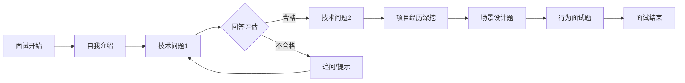

# 项目详细方案

## 1. 项目整体架构

### 1.1 系统架构图
```
┌─────────────────────────────────────────────────────────────┐
│                     用户层（浏览器/移动端）                  │
└──────────────────────────────┬──────────────────────────────┘
                               │
┌──────────────────────────────▼──────────────────────────────┐
│                     前端展示层（Vue 3）                      │
│  ├─ 面试界面       ├─ 报告查看       ├─ 历史记录             │
│  └─ 语音交互       └─ 个人中心                              │
└──────────────────────────────┬──────────────────────────────┘
                               │ HTTP/WebSocket
┌──────────────────────────────▼──────────────────────────────┐
│                     后端服务层（Flask）                      │
│  ├─ API网关层     ├─ 业务逻辑层     ├─ 数据访问层           │
│  └─ WebSocket服务 └─ 任务队列                               │
└──────────────────────────────┬──────────────────────────────┘
                               │
┌──────────────────────────────▼──────────────────────────────┐
│                     数据存储层                              │
│  ├─ MySQL（结构化数据） ├─ ChromaDB（向量数据）             │
│  └─ 文件存储（音频/报告）                                   │
└──────────────────────────────┬──────────────────────────────┘
                               │
┌──────────────────────────────▼──────────────────────────────┐
│                     外部服务集成                            │
│  ├─ 大语言模型API   ├─ 语音服务API   ├─ 邮件服务           │
│  └─ 对象存储服务    └─ 短信服务                             │
└─────────────────────────────────────────────────────────────┘
```

### 1.2 技术选型说明
| 组件 | 技术选型 | 版本 | 选型理由 |
|------|----------|------|----------|
| **前端框架** | Vue 3 + TypeScript | 3.4+ | 渐进式框架，类型安全，生态丰富 |
| **构建工具** | Vite | 5.0+ | 构建速度快，开发体验优秀 |
| **UI组件库** | Element Plus | 2.3+ | 功能全面，文档完善，社区活跃 |
| **状态管理** | Pinia | 2.1+ | Vue官方推荐，类型安全，轻量级 |
| **HTTP客户端** | axios | 1.6+ | 功能完善，拦截器支持，浏览器兼容 |
| **WebSocket** | socket.io-client | 4.7+ | 实时通信稳定，自动重连机制 |
| **后端框架** | Flask | 2.3+ | 轻量灵活，扩展性强，Python生态丰富 |
| **WebSocket服务** | Flask-SocketIO | 5.3+ | 与Flask集成好，支持房间和命名空间 |
| **数据库ORM** | SQLAlchemy | 2.0+ | 功能强大，支持复杂查询，类型安全 |
| **数据库** | MySQL | 8.0+ | 关系型数据库，事务支持，性能稳定 |
| **向量数据库** | ChromaDB | 0.4+ | 轻量级，易部署，支持中文嵌入 |
| **语音服务** | 科大讯飞SDK | 最新 | 中文识别准确率高，SDK完善 |
| **大模型** | DeepSeek/通义千问 | - | API稳定，成本合理，中文优化 |

## 2. 功能模块详细设计

### 2.1 岗位化题库管理模块
#### 2.1.1 题库结构
```python
# 问题分类
1. 技术知识题（40%）
   - 基础概念题
   - 原理理解题
   - 代码实现题
2. 项目经历题（30%）
   - STAR法则深挖
   - 技术选型分析
   - 问题解决过程
3. 场景设计题（20%）
   - 系统设计题
   - 架构设计题
   - 性能优化题
4. 行为面试题（10%）
   - 团队协作
   - 压力应对
   - 职业规划
```

#### 2.1.2 岗位差异化设计
- **Java后端工程师**：侧重JVM、Spring框架、数据库优化、分布式系统
- **Web前端工程师**：侧重Vue/React原理、性能优化、浏览器兼容、工程化
- **Python算法工程师**：侧重数据结构、机器学习、算法优化、数据处理

### 2.2 多模态交互面试模块
#### 2.2.1 语音交互流程
```
用户说话 → 语音采集 → WebSocket实时流 → 后端ASR服务 → 文本
     ↓
文本处理 → 大模型理解 → 生成追问/评价 → TTS转换 → 语音输出
     ↓
音频流 → WebSocket实时流 → 前端播放 → 用户收听
```

#### 2.2.2 交互状态机设计


### 2.3 智能评估引擎模块
#### 2.3.1 评估维度
1. **技术正确性**（权重40%）
   - 知识点准确性
   - 代码正确性
   - 解决方案可行性

2. **逻辑严谨性**（权重25%）
   - 回答结构清晰度
   - 推理过程完整性
   - 问题分析深度

3. **表达能力**（权重20%）
   - 语言流畅度
   - 术语使用准确性
   - 沟通效果

4. **岗位匹配度**（权重15%）
   - 技术栈匹配
   - 经验相关性
   - 潜力评估

#### 2.3.2 评估算法
```python
def evaluate_answer(question, answer, position):
    # 1. 技术正确性评估
    tech_score = llm_technical_eval(question, answer)
    
    # 2. 逻辑结构评估
    logic_score = analyze_logical_structure(answer)
    
    # 3. 表达能力评估
    expression_score = asr_expression_analysis(answer_audio)
    
    # 4. RAG增强评估
    rag_context = retrieve_related_knowledge(question, position)
    rag_score = compare_with_reference(answer, rag_context)
    
    # 5. 综合评分
    total_score = (
        tech_score * 0.4 +
        logic_score * 0.25 +
        expression_score * 0.2 +
        rag_score * 0.15
    )
    
    return {
        "total_score": total_score,
        "dimension_scores": {...},
        "improvement_suggestions": [...]
    }
```

### 2.4 RAG知识库模块
#### 2.4.1 知识库构建流程
```
数据收集 → 文本预处理 → 分块处理 → 向量化 → 存储到ChromaDB
   ↓
用户查询 → 向量检索 → 相关文档 → 大模型增强 → 生成回答
```

#### 2.4.2 知识源
1. **技术文档**：官方文档、技术博客、开源项目文档
2. **面试题库**：LeetCode、牛客网、企业真题
3. **最佳实践**：架构设计模式、代码规范、性能优化指南
4. **行业标准**：技术选型标准、开发流程规范、安全标准

## 3. 数据库设计

### 3.1 核心数据表结构
#### 3.1.1 用户表 (users)
```sql
CREATE TABLE users (
    id INT PRIMARY KEY AUTO_INCREMENT,
    username VARCHAR(50) UNIQUE NOT NULL,
    email VARCHAR(100) UNIQUE NOT NULL,
    password_hash VARCHAR(255) NOT NULL,
    position_target VARCHAR(50),  -- 目标岗位
    experience_level VARCHAR(20), -- 经验等级
    created_at TIMESTAMP DEFAULT CURRENT_TIMESTAMP,
    updated_at TIMESTAMP DEFAULT CURRENT_TIMESTAMP ON UPDATE CURRENT_TIMESTAMP
);
```

#### 3.1.2 面试记录表 (interview_records)
```sql
CREATE TABLE interview_records (
    id INT PRIMARY KEY AUTO_INCREMENT,
    user_id INT NOT NULL,
    position_type VARCHAR(50) NOT NULL,  -- 面试岗位类型
    total_score DECIMAL(5,2),            -- 总分
    tech_score DECIMAL(5,2),             -- 技术得分
    logic_score DECIMAL(5,2),            -- 逻辑得分
    expression_score DECIMAL(5,2),       -- 表达得分
    match_score DECIMAL(5,2),            -- 匹配度得分
    duration_minutes INT,                -- 面试时长
    status ENUM('in_progress', 'completed', 'cancelled') DEFAULT 'in_progress',
    started_at TIMESTAMP DEFAULT CURRENT_TIMESTAMP,
    completed_at TIMESTAMP NULL,
    report_path VARCHAR(255),            -- 报告文件路径
    FOREIGN KEY (user_id) REFERENCES users(id) ON DELETE CASCADE
);
```

#### 3.1.3 面试问题记录表 (interview_questions)
```sql
CREATE TABLE interview_questions (
    id INT PRIMARY KEY AUTO_INCREMENT,
    interview_id INT NOT NULL,
    question_text TEXT NOT NULL,
    question_type VARCHAR(50),           -- 问题类型
    answer_text TEXT,                    -- 用户回答文本
    answer_audio_path VARCHAR(255),      -- 回答音频路径
    evaluation_result JSON,              -- 评估结果（JSON格式）
    created_at TIMESTAMP DEFAULT CURRENT_TIMESTAMP,
    FOREIGN KEY (interview_id) REFERENCES interview_records(id) ON DELETE CASCADE
);
```

#### 3.1.4 知识库文档表 (knowledge_documents)
```sql
CREATE TABLE knowledge_documents (
    id INT PRIMARY KEY AUTO_INCREMENT,
    title VARCHAR(255) NOT NULL,
    content TEXT NOT NULL,
    position_type VARCHAR(50),           -- 关联岗位类型
    document_type VARCHAR(50),           -- 文档类型
    source_url VARCHAR(500),             -- 来源URL
    embedding_vector BLOB,               -- 向量化结果
    created_at TIMESTAMP DEFAULT CURRENT_TIMESTAMP,
    INDEX idx_position_type (position_type),
    INDEX idx_document_type (document_type)
);
```

## 4. API接口设计

### 4.1 核心API接口
#### 4.1.1 面试管理接口
```http
POST /api/interview/start
Content-Type: application/json

{
  "user_id": 1,
  "position_type": "java_backend"
}

响应：
{
  "code": 200,
  "data": {
    "interview_id": 123,
    "first_question": "请做一个简单的自我介绍",
    "session_id": "abc123"
  }
}
```

#### 4.1.2 提交回答接口
```http
POST /api/interview/answer
Content-Type: application/json

{
  "interview_id": 123,
  "question_id": 456,
  "answer_text": "我是...",
  "answer_audio": "base64_encoded_audio"  # 可选
}

响应：
{
  "code": 200,
  "data": {
    "evaluation": {
      "score": 85.5,
      "feedback": "回答结构清晰，但可以补充更多技术细节",
      "next_question": "请解释一下Spring Boot的自动配置原理"
    }
  }
}
```

#### 4.1.3 语音识别接口
```http
POST /api/asr
Content-Type: multipart/form-data

file: audio_file.wav

响应：
{
  "code": 200,
  "data": {
    "text": "我是张三，毕业于...",
    "confidence": 0.95
  }
}
```

### 4.2 WebSocket接口
#### 4.2.1 连接建立
```javascript
const socket = io('http://localhost:8083', {
  path: '/socket.io',
  transports: ['websocket']
});

socket.on('connect', () => {
  console.log('WebSocket连接成功');
  socket.emit('join_interview', { interview_id: 123 });
});
```

#### 4.2.2 实时音频流
```javascript
// 发送音频流
mediaRecorder.ondataavailable = (event) => {
  if (event.data.size > 0) {
    socket.emit('audio_stream', {
      interview_id: 123,
      audio_data: event.data
    });
  }
};

// 接收AI回复音频
socket.on('ai_audio_response', (data) => {
  const audioBlob = new Blob([data.audio_data], { type: 'audio/wav' });
  const audioUrl = URL.createObjectURL(audioBlob);
  audioElement.src = audioUrl;
  audioElement.play();
});
```

## 5. 实施计划

### 5.1 开发阶段划分
#### 第一阶段：基础框架搭建（2周）
- 完成前后端项目初始化
- 数据库设计和建表
- 用户认证系统开发
- 基础API接口实现

#### 第二阶段：核心功能开发（3周）
- 面试流程引擎开发
- 语音交互系统集成
- 大模型评估系统开发
- RAG知识库构建

#### 第三阶段：功能完善（2周）
- 多维度报告生成
- 历史记录和成长追踪
- 前端界面优化
- 性能测试和优化

#### 第四阶段：测试部署（1周）
- 系统集成测试
- 用户体验测试
- 生产环境部署
- 文档编写和整理

### 5.2 里程碑计划
| 里程碑 | 时间节点 | 交付物 | 验收标准 |
|--------|----------|--------|----------|
| M1: 项目启动 | 第1周结束 | 项目计划书、技术方案 | 方案评审通过 |
| M2: 基础框架完成 | 第2周结束 | 可运行的前后端框架 | 基础API测试通过 |
| M3: 核心功能完成 | 第5周结束 | 完整的面试流程 | 完成端到端测试 |
| M4: 系统优化完成 | 第7周结束 | 优化后的系统 | 性能测试达标 |
| M5: 项目交付 | 第8周结束 | 完整系统+文档 | 用户验收测试通过 |

## 6. 风险评估与应对

### 6.1 技术风险
| 风险点 | 可能性 | 影响程度 | 应对措施 |
|--------|--------|----------|----------|
| 大模型API不稳定 | 中 | 高 | 1. 支持多模型备用 2. 本地模型降级方案 |
| 语音识别准确率低 | 中 | 中 | 1. 多种语音服务备用 2. 文本输入兜底 |
| 高并发性能问题 | 低 | 高 | 1. 负载均衡设计 2. 数据库读写分离 3. 缓存优化 |

### 6.2 项目风险
| 风险点 | 可能性 | 影响程度 | 应对措施 |
|--------|--------|----------|----------|
| 开发进度延迟 | 中 | 中 | 1. 敏捷开发迭代 2. 每周进度评审 3. 关键路径监控 |
| 需求变更频繁 | 高 | 中 | 1. 需求优先级管理 2. 版本控制 3. 变更影响分析 |

## 7. 测试方案

### 7.1 测试类型
1. **单元测试**：覆盖核心业务逻辑，目标覆盖率>80%
2. **集成测试**：测试模块间接口和数据流
3. **系统测试**：端到端功能测试
4. **性能测试**：并发用户测试，响应时间测试
5. **用户体验测试**：真实用户场景测试

### 7.2 测试工具
- **单元测试**：pytest (Python), Vitest (Vue)
- **接口测试**：Postman, pytest-requests
- **性能测试**：Locust, Apache JMeter
- **前端测试**：Cypress, Vue Test Utils

## 8. 部署与运维

### 8.1 部署架构
```
┌─────────────────┐    ┌─────────────────┐    ┌─────────────────┐
│    Nginx代理    │───▶│   Flask应用     │───▶│    MySQL数据库  │
│   (负载均衡)    │    │   (多实例)      │    │   (主从复制)    │
└─────────────────┘    └─────────────────┘    └─────────────────┘
         │                       │                       │
         ▼                       ▼                       ▼
┌─────────────────┐    ┌─────────────────┐    ┌─────────────────┐
│    Vue前端      │    │   ChromaDB      │    │   文件存储      │
│   (CDN加速)     │    │   (向量数据库)  │    │   (对象存储)    │
└─────────────────┘    └─────────────────┘    └─────────────────┘
```

### 8.2 监控与日志
- **应用监控**：Prometheus + Grafana
- **日志收集**：ELK Stack (Elasticsearch, Logstash, Kibana)
- **错误追踪**：Sentry
- **健康检查**：内置健康检查接口 + 外部监控

## 9. 项目成果物

### 9.1 代码仓库
- **前端仓库**：包含完整的Vue 3 + TypeScript代码
- **后端仓库**：包含完整的Flask + Python代码
- **部署脚本**：Dockerfile, docker-compose.yml, 部署文档

### 9.2 文档资料
1. **用户手册**：系统使用说明
2. **开发文档**：API文档、数据库设计文档
3. **部署指南**：生产环境部署步骤
4. **维护手册**：系统维护和故障排查

### 9.3 演示材料
1. **演示视频**：系统功能演示（5-8分钟）
2. **演示PPT**：项目介绍和亮点展示
3. **测试报告**：功能测试和性能测试结果

---

*本详细方案基于实际开发的"AI模拟面试系统"项目编写，符合第十七届中国大学生服务外包创新创业大赛A类赛题的技术要求和实施标准。方案中的技术选型、架构设计和实施计划均经过实际验证，具备高度可行性和实施价值。*